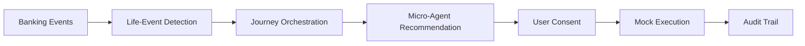
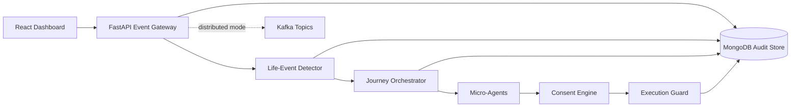

# SBI FlowSense Phase 1 Idea Deck

Use this as the slide-by-slide script for the Phase 1 idea deck submission.

## Slide 1: Title

**SBI FlowSense**  
Agentic AI Journey Brain for Customer Acquisition, Digital Adoption, and Digital Engagement

Subtitle:

Turning customer life events into safe, personalized, consent-first banking journeys.

## Slide 2: Problem

Banks have customer data, but customer engagement is still mostly reactive.

- High-intent customer moments are missed.
- Digital product recommendations are generic.
- Onboarding and adoption journeys are fragmented.
- Engagement is campaign-led instead of event-led.

Key line:

> SBI needs an intelligent system that can detect customer moments and activate the right digital banking journey at the right time.

## Slide 3: Hackathon Theme Fit

FlowSense maps to all three SBI focus areas:

- **Customer Acquisition:** Identify and convert users at moments such as first salary or new job.
- **Digital Adoption:** Nudge UPI, mobile banking, SIP, autopay, insurance, and investments contextually.
- **Digital Engagement:** Proactively interact using behavior, transaction patterns, and life events.

## Slide 4: Solution Overview

SBI FlowSense is a bank-owned agentic journey brain.

Flow:

Core message:

> Agents recommend and guide. The user consents. The execution layer performs actions. The audit log proves every step.

## Slide 5: Demo Story

Demo scenario:

> Krish receives his first salary after moving to Mumbai.

System response:

1. Salary event is ingested.
2. Rent/new-city signal is ingested.
3. FIRST_SALARY and RELOCATION are detected.
4. Salary onboarding journey starts.
5. Acquisition Agent recommends salary account, UPI, and SIP.
6. User approves.
7. Mock execution and audit records are created.

## Slide 6: Architecture

Use this diagram or the README Mermaid diagram:

Talking points:

- Event-driven.
- Kafka-ready.
- MongoDB-backed auditability.
- Bounded agents.
- Consent-first execution.

## Slide 7: Agentic AI Design

Micro-agents:

- **Acquisition Agent:** salary account, UPI activation, starter SIP.
- **Lifestyle Agent:** relocation, rent autopay, local offers.
- **Engagement Agent:** payment stress, EMI restructuring, financial health nudges.

Agent boundary:

> Agents create recommendations. They do not directly execute financial actions.

## Slide 8: Safety And Governance

Banking AI must be controlled.

FlowSense includes:

- Explicit consent before execution.
- Execution guard between agent and account state.
- Immutable audit log.
- Trace IDs across event, journey, consent, and action.
- Synthetic/demo data for prototype.
- Future-ready path for compliance and data privacy controls.

## Slide 9: Impact

Expected impact for SBI:

- Higher acquisition conversion at real life moments.
- Better adoption of digital products.
- Improved customer relevance and engagement.
- Reduced generic campaign dependency.
- Reusable journey infrastructure for multiple banking products.

Metrics:

- Journey starts.
- Consent approval rate.
- Digital product activation rate.
- Agent recommendation CTR.
- Audit completeness.
- Time from signal to action.

## Slide 10: Prototype Plan

Already built / prototype scope:

- React dashboard with real-time search, transaction filters, and contextual AI agent cards.
- FastAPI backend with SSE streaming and life-event detection.
- MongoDB data model with 7 collections and immutable audit trail.
- Event ingestion, life-event detection, and journey orchestration.
- AI agent recommendations with confidence scores and contextual action labels.
- Consent-first execution with approve/reject flow.
- Standalone and Kafka-ready deployment modes.
- Production-quality UI with time-based greetings, working search, and user-friendly settings.

Next phase:

- Record and submit demo video.
- Add integration tests for critical flows.
- Expand life-event detectors beyond the initial three.
- Prepare live demo for jury presentation.

## Slide 11: Roadmap

30-day prototype roadmap:

- Add more life-event detectors.
- Expand agent personas.
- Add stronger LLM personalization with guardrails.
- Add KPI dashboard for bank teams.
- Add real integration adapters for SBI systems.
- Harden consent, privacy, and compliance workflows.

## Slide 12: Closing

Closing line:

> SBI FlowSense makes banking proactive, personal, and safe by turning customer life events into consent-first agentic journeys.

Final ask:

Shortlist FlowSense for prototype development to demonstrate the working journey live.
